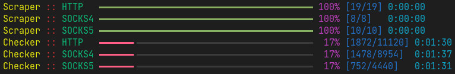

# proxy-scraper-checker

[](https://github.com/monosans/proxy-scraper-checker/actions/workflows/ci.yml)



HTTP, SOCKS4, SOCKS5 proxies scraper and checker.


You can get proxies obtained using this script in [victorgeel/proxy-list](https://github.com/victorgeel/proxy-list-update).

## Termux တစ်မျိုးပဲသုံး

### Termux

To use `proxy-scraper-checker` in Termux, knowledge of the Unix command-line interface is required.

- Download Termux from [F-Droid](https://f-droid.org/en/packages/com.termux/). [Don't download it from Google Play](https://github.com/termux/termux-app#google-play-store-deprecated).
- Run the following command (it will automatically update Termux packages, install Python, and download and install `proxy-scraper-checker`):
  ```bash
  bash <(curl -fsSL 'https://raw.githubusercontent.com/victorgeel/proxy-here-Noobs/modified/install-termux.sh')
  ```
- Edit `~/proxy-scraper-checker/config.ini` to your preference using a text editor (vim/nano).
- To run `proxy-scraper-checker` use the following command:
  ```bash
  cd ~/proxy-here-Noobs && sh start-termux.sh
  or
  cd /data/data/com.termux/files/home/proxy-here-Noobs && sh start-termux.sh
  ```
